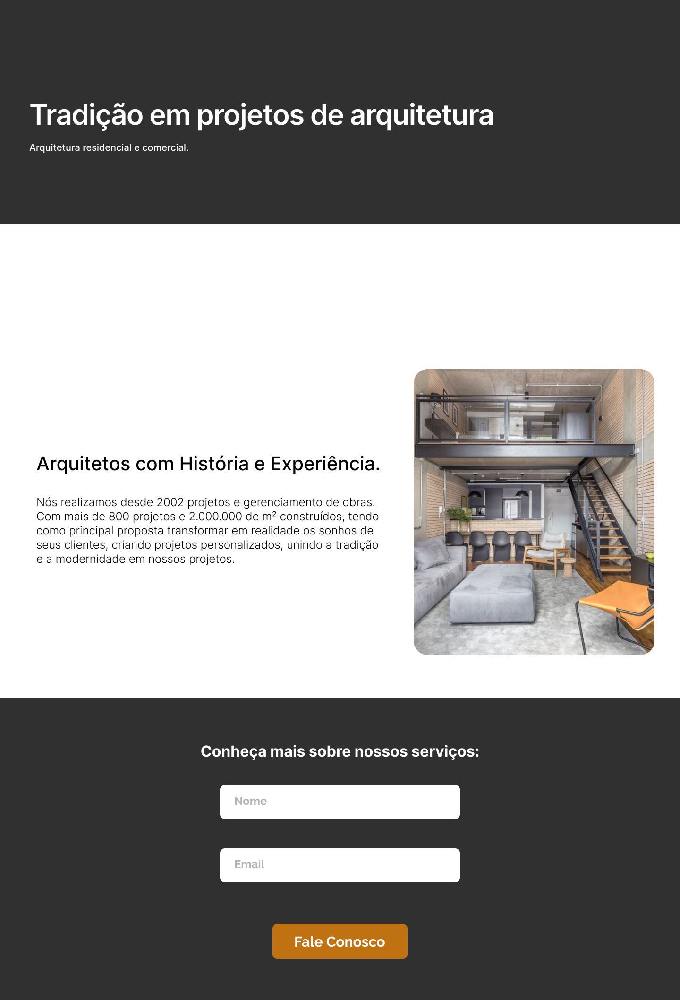

<h1 align="center"> DNC - Challenge 01 ✅ </h1>
 

## 🔗 Links:

- [See this project online](#)  
- [See the information record worksheet](https://docs.google.com/spreadsheets/d/1dNIIthkqKq176wFojX9fsrObz025rKXF1_Z7MZYmInw/edit?usp=sharing)

## 💻 About the project:

This project was developed as a way to study how to create a landing page to an architectury company, for this project I have used the [Figma provide by DNC](https://www.figma.com/file/0FRiZbs30dfSniazKiM1rM/Desafio-1---Desenvolva-uma-Landing-Page?type=design&node-id=1-3&t=xQSbT0shgf79k7Dy-0) to develop this project.

## ⚡️ This project was developed using this following techs:
  <ul>
    <li> HTML</li>
    <li> CSS</li>
    <li> Sheet Monkey</li>
    <li> Figma</li>
 </ul>
 

 Hope you enjoy as much as I have! ⭐

## 📸 Screenshot:

  

